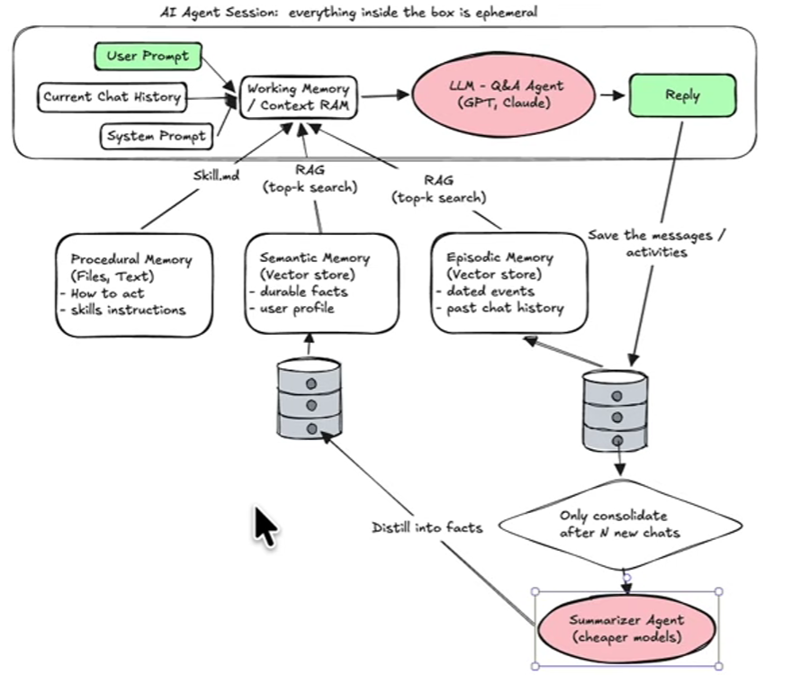

Core components 
form providers, 

- asr
- intent
- llm
- memory
- tools
- tts
- vad
- vllm

Features to work out one by one / one at a time:
- asr
    fix the recognition
- memory
    apply memory
- prompt
    find out more about the propmt
- intent
    how to work out intent
- tools / mcp
    how to get that working.

Connenction.py
886 - 896, 

### AI Function calling / tools
how to get ai to use functions we created ourselves. 
ex: weather api function
prompt goes to ai,
ai thinks: ok i should see if i have a tool to check the weather
finds weather api function
executes weather api function
get result from weather api
passes result to ai
ai gives final answer to user

...
Initialisation: 
- function list is given to the llm
LLm receives prompt, looks into function list, decide to call function -> 
LLM checks with the function schema, decide the params for the function -> 
Call the function and get the result -> 
Pass the result to the LLM -> 
LLM generate the final response

Function list / schema is the same

The functions list is created automatically by loadplugins.py
# so the functions has a shape:
- sending tool list to the llm:
try:
    response = client.responses.create(
        model="gpt-4o",
        instructions="You are a helpful assistant with access to weather, todo, and traffic tools.",
        previousNormally I can help with things like this, but I don't seem to have access to that content. You can try again or ask me for something else.
        
- functionDescription:
get_lunar_function_desc = {
    "type": "function",
    "function": {
        "name": "get_lunar",
        "description": (
            "用于具体日期的阴历/农历和黄历信息。"
            "用户可以指定查询内容，如：阴历日期、天干地支、节气、生肖、星座、八字、宜忌等。"
            "如果没有指定查询内容，则默认查询干支年和农历日期。"
            "对于'今天农历是多少'、'今天农历日期'这样的基本查询，请直接使用context中的信息，不要调用此工具。"
        ),
        "parameters": {
            "type": "object",
            "properties": {
                "date": {
                    "type": "string",
                    "description": "要查询的日期，格式为YYYY-MM-DD，例如2024-01-01。如果不提供，则使用当前日期",
                },
                "query": {
                    "type": "string",
                    "description": "要查询的内容，例如阴历日期、天干地支、节日、节气、生肖、星座、八字、宜忌等",
                },
            },
            "required": [],
        },
    },
}
- execution

## End of Tools

## Prompting
- base prompt comes form .config.yaml
- prompt_manager.py can add context information into the base prompt
- agennt-basep-prompt.txt is the base prompt template

<do figgure out later> when the server prompts the llm model, it sends out instructions and prompts. takes the response and filters it, then uses that. but it could also force the ai to ommit things while thinking and such..

runnning deepseek-r1:1.5b caused issuse where the ai rambles on and on, long, kind of incoherent responses
possible reasons for this being the model is a thinking model, which our server strips, and its a small model being injected a large prompt file 'agennt-base-prompt.txt'

what actually happened today?
found out that main loop processes occurs at conenction.py, chat function
this loop processes the messages from the esp32
and generates the responses, using the cores

tested the llm performance in local test server, found issues, prolly because its a thinking type and small. 

llm.py calls up ollama.py, within ollama.py we are prompting the ai, then modifying it directly to be used in tts (standard procedures for tts apparently)

changed to a non thinking model, works quite well

<for expansion> modify the prompt to suite the orignial vision. change the tts sounds.

## End of Prompting

## Memory 

currently using powermem. just had to set it up a bit. 
there are a couple ai working on different parts of it. for conversation and memory saving (embedding) they use different ai
seems like mcp is involved, but im not sure. seems like i did little to no configuration to make it work tho, its like plug and play........

## End of Memory

## Intent / tools / mcp
its all interconected, 
    Intent: the different configurations is the different methods ai identifies which tool to use. There is one where it passes another ai, and the other is a simpler more robust json list.
    Tools: custom python code that that helps ai get specific information / calculations api like
    MCP: basically api for LLMs.
## End of Intent / tools / mcp

## something
1. How the Scope Changes the Engineering Rules
If you were building this for real-world deployment, the architectural rules would diverge significantly based on user behavior:

The "30–60 Min Play Thing" (Toy Mode): * Rules: High-intensity stimulation, rapid state transitions.

Engineering Constraint: Emotions must fluctuate quickly so the child experiences them within a brief window. Autonomy needs to trigger every 1–2 minutes of silence, or the child loses interest. Long-term memory tracking is low priority.

The "Bring Around All Day Companion" (Tamagotchi Mode):

Rules: Low passive power consumption, trickle-drained metrics.

Engineering Constraint: Hardware state machines must handle long deep-sleep/wake cycles. Attention shouldn't drop to zero in 5 minutes; it needs to decay slowly over hours. Proactive behaviors must be strictly throttled to prevent interrupting the child at school or draining the ESP32 battery.

The "After-School / Learning Partner" (Session Mode):

Rules: Goal-oriented, structured state logic.

Engineering Constraint: Centralized context tracking via memory systems (like PowerMem/MCP). The dynamic state machine needs to track a "boredom/fatigue index" that reflects learning engagement rather than pure isolation.

## End of something

## Phase Flow
1. write code to create session memory json

2. Inject Phase-Specific System Prompts
How it works: Before hitting Ollama, your script reads the phase value from the JSON. Instead of a single massive prompt, you maintain a dictionary of prompt components:

PROMPTS[1]: "You are in Phase 1 (Onboarding). Be chatty and figure out the task, steps, and success scenario. Once you have all three, call the update_session_goals tool immediately."

PROMPTS[2]: "You are in Phase 2 (Monitoring). The user is working on [TASK]. Maintain a normal conversation. Do not use onboarding tools."

3. have a thinking llm check if user response is appropriate for the phase criteria, then have it autonomously call update session goals function
3. The Optimization: Ditch the Second "Thinking" LLM
The Critique: Running a separate LLM call just to inspect if the user gave the right info doubles your API cost and interaction latency.

The Fix: Rely entirely on Native Function Calling. You provide the update_session_goals tool schema to Ollama only while phase == 1. The LLM naturally knows when it has collected enough data from the child to populate the arguments. The moment it executes the tool, your Python code processes the arguments, writes them to the JSON file, and explicitly overrides the state parameter: "phase": 2.

4. write code to somehow detect that phase has shifted and modify the prompt injection.......
4. Dynamic Prompt / Tool Interception
How it works: On every message turn, your message router reads the file. If it sees "phase": 2, it drops the onboarding tool from the roster entirely and changes the text base system instruction array. This prevents the LLM from accidentally trying to re-onboard the kid mid-session.

[session_memory.json] ──> Read Phase ──> [Prompt Manager] ──> Selects Template
                                                                    │
[Sensory Task Thread] ──> Read Metrics ─────────────────────────────┼──> [Prompt Enhancer]
                                                                    │
                                                                    ▼
[Finalized Payload] ──> [Ollama Engine]

[User Utterance] ──> Read session_memory.json (Find Phase ID)
                            │
                            ├──> Inject Dynamic System Prompt for that Phase
                            └──> Bind Phase-Specific Tools
                            │
                            ▼
                    [Ollama LLM Engine]
                            │
            ┌───────────────┴───────────────┐
            ▼ (Normal Response)             ▼ (Tool Invocation)
     Stream back to kid             Execute Python code ──> Update JSON Phase ──> Loop Continues

On every message turn (inside core/handle/textMessageProcessor.py or the request router before calling Ollama):
[User Utterance] ──> Read session_memory.json
                            │
                            ├──> [Prompt Manager]: Selects base template matching the current Phase
                            └──> [Prompt Enhancer]: Appends active Telemetry Metrics & Live Time
                                        │
                                        ▼
                            [Final Dynamic Prompt] ──> Bind Phase-Specific Tools ──> [Ollama LLM]